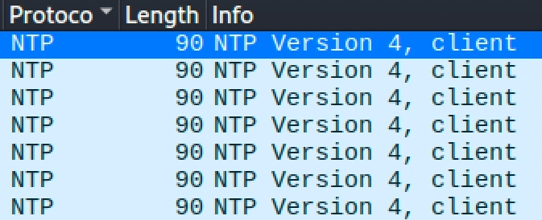
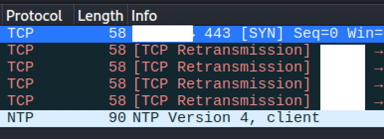

<h1 align="center">Trust but Verify: Packet Sniffing My Blink Camera's Network Traffic</h1>

I’m always fascinated with offensive security, and today I put my knowledge to the test. We have a set of Blink cameras, and for some reason, I received an email warning me about high camera data usage. This alarmed me since all my cameras are scheduled to arm at a certain time, and it was 3 hours before my scheduled arm time. I immediately contacted support, and the representative told me it was probably a glitch in their system. I ended the chat, but as someone who loves offsec, I didn't just take their word for it. I decided to investigate it myself.

I know for a fact that my home network is not perfectly secure. I currently just use a modem with a built-in router from my ISP. I don’t have the money to spend on designing enterprise-grade network infrastructure right now, but hopefully, someday I can afford it. To make sure my cameras weren't secretly recording while disarmed, I loaded up my Kali Linux VM (feeling like a hacker) and started setting up a network sniff to intercept the traffic.

I did a lot of troubleshooting before I made it to work. The first problem I faced was that my ARP spoofing tool wasn't working in my VM. My VM network was set to NAT, which isolates the VM in a virtual subnet, making it unable to send Layer 2 broadcasts to detect the camera's IP. I changed the VM to Bridged mode, but the same problem persists. I realized VMware uses MAC translation (ARP Proxy) for Wi-Fi bridging, which actively blocks forged ARP packets from leaving the host machine. Fortunately, I had USB NIC. I plugged it directly into my machine, passed it through to Kali, ran <i>ip a</i>, and voila, it pulled a proper local IP address on my physical subnet.

To intercept the network traffic, I opened two separate terminal windows. I used these commands:

<ol>
<li><b>Terminal Window 1:</b></li>
<i>sudo arpspoof -i wlan0 -t gateway_ip camera_ip</i>

<li><b>Terminal Window 2:</b></li>
<i>sudo arpspoof -i wlan0 -t camera_ip gateway_ip</i>
</ol>
You might be wondering why we need two windows running arpspoof. Network communication is a two-way street, so you have to trick both devices to capture the full conversation. It goes like this:
<ul>
  <li><b>Terminal Window 1</b> command poisons the router: <i>“Hey Router! I am the camera. Send the camera's incoming internet replies to me.</i>”</li>
  <li><b>Terminal Window 2</b> command poisons the camera: <i>“Hey Camera! I am the router. Send all your outgoing traffic to me.”</i></li>
</ul>

After running those commands, I opened Wireshark, set it to listen on `wlan0` (my USB NIC), and successfully intercepted the packets.

All the captured packets (ran for 5 minutes) were NTP (Network Time Protocol) background traffic. At this point, I could confidently say the high-usage warning was just a glitch in their system. If the camera were actually recording and uploading video, the traffic would be UDP or TCP, and the packet lengths would be continuously maxing out around 1400-1500 bytes, not sitting around 90 bytes.

To test that theory and prove my capture was working, I triggered a Live View in my Blink mobile app.

Wireshark immediately lit up with TCP packets as the camera tried to establish a video stream. Interestingly, the live video feed actually failed to load on my phone. Because I was routing the heavy video traffic through my single USB Wi-Fi adapter, it created a half-duplex bottleneck and acted as an accidental Denial of Service (DoS) attack against my own camera, dropping the connection. As you can also notice the length of my TCP is lower than the NTP, the reason why it is lower is that it is just a retransmission with 0 payload (actual data).

Even with the dropped connection, the packet data told me exactly what I needed to know. I can definitively conclude the support representative was right: the camera was not recording when disarmed, and the alert was just a system glitch.

 

  <b>
    Note: Do not scan networks that you don't have permission to scan! This program is intended for education purposes only. Using this program for unauthorized network scanning or malicious activities is strictly prohibited. I am not responsible for any misuse or legal repercussions that may arise from unauthorized scanning.
  </b>

